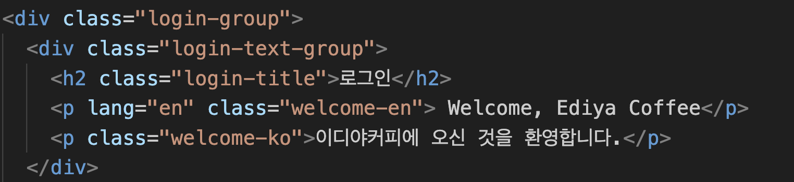

# mission-02

## 마크업

## 기본 설정

@import 방식으로 모던 리셋과 폰트를 설정 함.

## 반응형 웹 디자인

1. flexbox로 전체 요소 display 설정 함.
2. 속성 값의 단위를 백분율과 뷰포트 사용

3. 미디어쿼리를 사용해 600px이하(모바일)의 뷰포트 특성에 따라 스타일과
  레이아웃이 동적으로 변경 되게 함.
  -로그인 버튼과 회원가입 버튼의 배열이 수평에서 수직으로 바뀜.
  -이메일 및 패스워드 input 요소의 width가 540px->311px로 바뀜.
  -로그인 button 및 회원가입 anchor의 260px->311px로 바뀜.

