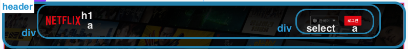
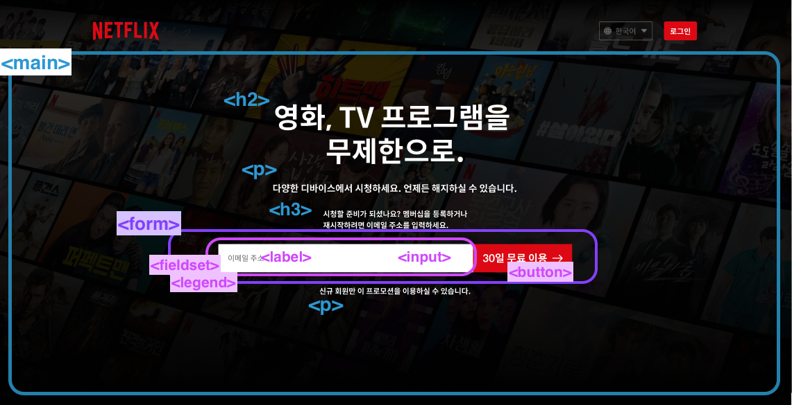
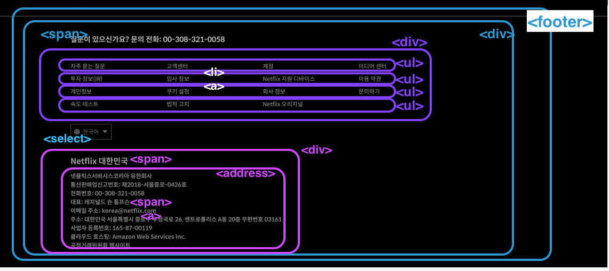
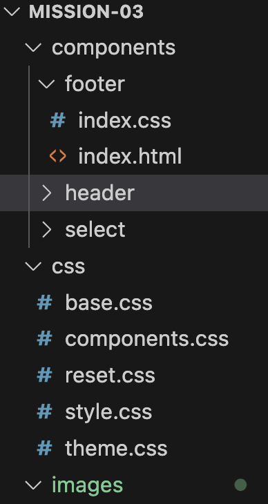
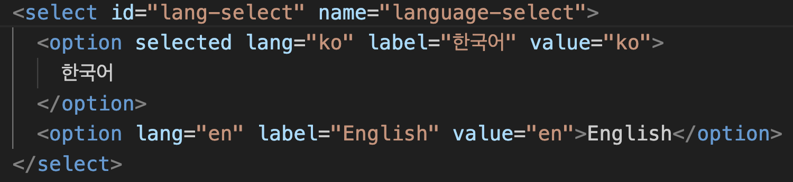
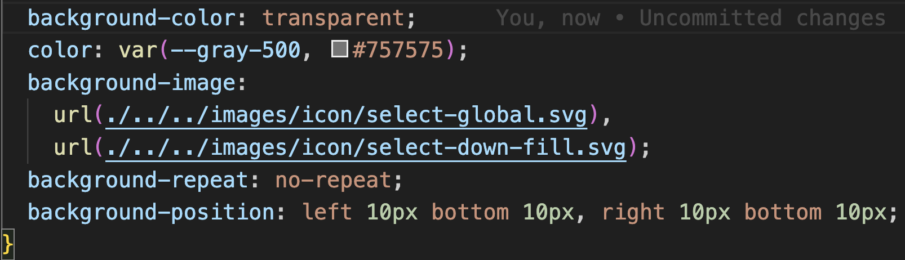
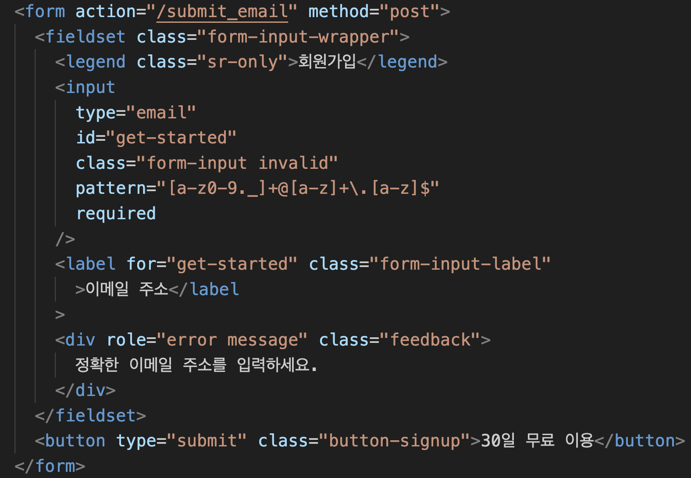

#마크업

##헤더

##메인

##푸터

#컴포넌트 방식으로 구성

#select
##html

##css

셀렉트 커스터마이징

1. appearance: none;
   기본 화살표 없애기

2. background-image: url(/), url(/);
   셀렉트 백그라운드에 두 이미지 넣기

##video

#form
##html

##video

#반응형 구현
전체적인 레이아웃은 플랙스박스로 구성 후,
미디어쿼리를 통해 600px을 브레이크 포인트로 너비에 따른
반응형을 구현 함.

#video
